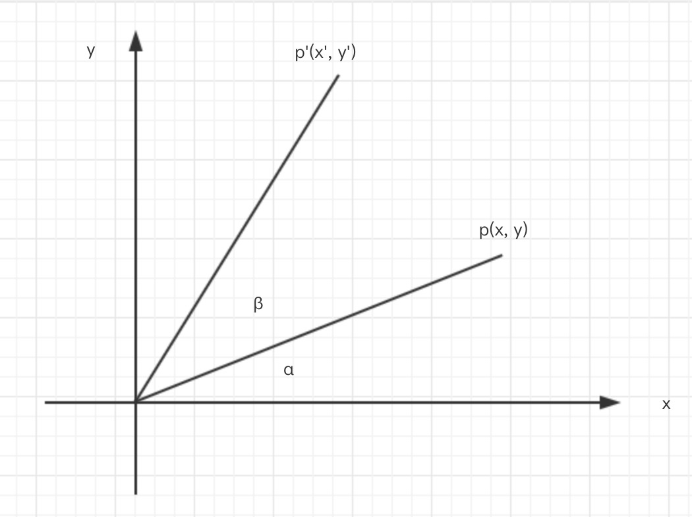

## webgl-rotation


详情参见初中 `勾股定理`,`正余弦定律` 和 `三角形两角和公式`。

根据上图, 由原角度为 `α` 的 `p` 点旋转 `β` 变换到 `p'` 点。

现在假定 `r` 为线段长度(开方 x<sup>2</sup>+y<sup>2</sup>)。

`cos` 为余弦 `sin` 为正弦。

`cosα = x / r`, 即 直角三角形邻边比斜边。
`sinα = y / r`, 即 直角三角形对边比斜边。

`两角和公式`:
sin(α - β) = (sinα cosβ - cosα sinβ)
sin(α + β) = (sinα cosβ + cosα sinβ)

cos(α - β) = (cosα cosβ + sinα sinβ)
cos(α + β) = (cosα cosβ - sinα sinβ)


```
解:
  x = r cosα
  y = r sinα

  x' = r cos(α + β)
  y' = r sin(α + β)

  由 三角形函数两角和公式 可知:

  x' = r(cosα cosβ - sinα sinβ)
  y' = r(sinα cosβ + cosα sinβ)

  经 乘法分配律 可知:

  x' = r cosα cosβ - r sinα sinβ
  y' = r sinα cosβ + r cosα sinβ

  代入 x,y 可知:

  x' = x cosβ - y sinβ
  y' = x sinβ + y cosβ
```