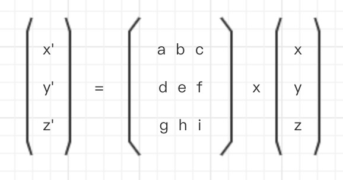
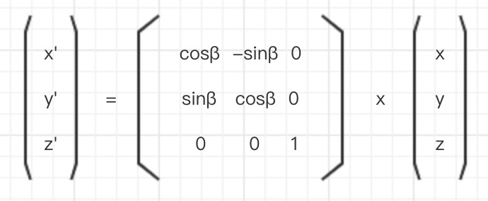
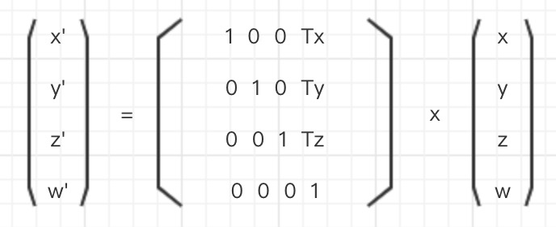

## webgl-translate-matrix
### 矩阵和矢量的乘法
矩阵和矢量的乘法可以写成如下等式:



上式中的这个矩阵有三行三列, 因此又被称为 `3x3矩阵`。

**注意**: 矩阵的乘法不符合交换律, 也就是说, `A x B` 并不等于 `B x A`。  
**注意**: 同时, 只有在矩阵的列数与矢量的行数相等时, 才可以将两者相乘。

通过上述等式可得下列等式:
```
x' = ax + by + cz
y' = dx + ey + fz
z' = gx + hy + iz
```

### 变换矩阵
由 `13.webgl-rotation` 中式子继续推导。

```
解:
  x' = x cosβ - y sinβ
  y' = x sinβ + y cosβ
  z' = z

  x' = ax + by + cz
  y' = dx + ey + fz
  z' = gx + hy + iz

  代入得:
  a = cosβ
  b = -sinβ
  c = 0
  d = sinβ
  e = cosβ
  f = 0
  g = 0
  h = 0
  i = 1
```

得到以下`变换矩阵`:



将右侧矢量`(x, y, z)` "变换"成左侧的矢量`(x', y', z')`, 因此称之为`变换矩阵`。

同时, 由于该矩阵惊醒的变换是一次旋转, 因此也称为`旋转矩阵`(rotation matrix)。  
当然, 对应的也有`缩放矩阵`和`平移矩阵`。

### 4x4平移矩阵
继续推导:
```
  x' = x + Tx
  y' = y + Ty
  z' = z + Tz

  x' = ax + by + cz
  y' = dx + ey + fz
  z' = gx + hy + iz
```

由上述式子可以很明显的看到, 正常平移操作是与对应轴`(x, y, z)`上移动一段距离。  
因此 `3x3矩阵` 已经无法满足当前的需求, 需要使用 4x4矩阵 来满足`(Tx, Ty, Tz)`, 同时为矢量添加第四个分量 `w`, 通常设定为 `1.0`。

得以下等式:
```
  x' = x + Tx
  y' = y + Ty
  z' = z + Tz
  w' = 1

  x' = ax + by + cz + d
  y' = ex + fy + gz + h
  z' = ix + jy + kz + l
  w' = mx + ny + oz + p
```

获得`转换矩阵`(`平移矩阵`):

