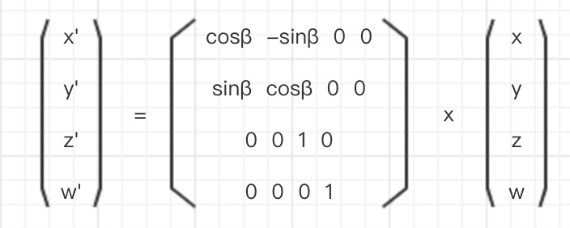

## webgl-rotation-matrix
### 4x4旋转矩阵
由 `14.webgl-translate-matrix` 继续推导,得以下等式:
```
  x' = x cosβ - y sinβ
  y' = x sinβ + y cosβ
  z' = z
  w' = 1

  x' = ax + by + cz + d
  y' = ex + fy + gz + h
  z' = ix + jy + kz + l
  w' = mx + ny + oz + p

  代入获得结果
```

获得`转换矩阵`(`旋转矩阵`):

