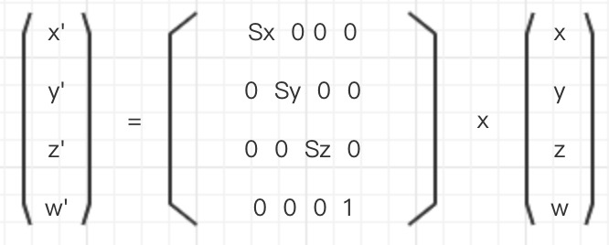

## webgl-scale-matrix
### 4x4缩放矩阵
由 `14.webgl-translate-matrix` 继续推导,得以下等式:
```
  x' = x Sx
  y' = y Sy
  z' = z Sz
  w' = 1

  x' = ax + by + cz + d
  y' = ex + fy + gz + h
  z' = ix + jy + kz + l
  w' = mx + ny + oz + p

  代入获得结果
```

获得`转换矩阵`(`缩放矩阵`):

