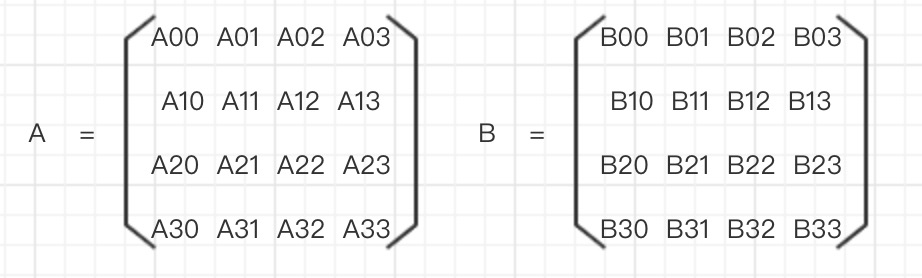

## webgl-matrix
### 使用矩阵的原因
根本原因`使用三角函数进行变换过于繁琐`, 同时也不利于进行复合变换。

### 乘法
有如下两个矩阵:



得 `AxB` 为如下结果:
```
A00xB00 + A01xB10 + A02xB20 + A03xB30 | A00xB01 + A01xB11 + A02xB21 + A03xB31 | A00xB02 + A01xB12 + A02xB22 + A03xB32 | A00xB03 + A01xB13 + A02xB23 + A03xB33
A10xB00 + A11xB10 + A12xB20 + A13xB30 | A10xB01 + A11xB11 + A12xB21 + A13xB31 | A10xB02 + A11xB12 + A12xB22 + A13xB32 | A10xB03 + A11xB13 + A12xB23 + A13xB33
A20xB00 + A21xB10 + A22xB20 + A23xB30 | A20xB01 + A21xB11 + A22xB21 + A23xB31 | A20xB02 + A21xB12 + A22xB22 + A23xB32 | A20xB03 + A21xB13 + A22xB23 + A23xB33
A30xB00 + A31xB10 + A32xB20 + A33xB30 | A30xB01 + A31xB11 + A32xB21 + A33xB31 | A30xB02 + A31xB12 + A32xB22 + A33xB32 | A30xB03 + A31xB13 + A32xB23 + A33xB33
```

### 变换
```
先平移再旋转: 
<平移后坐标> = <平移矩阵> x <原始坐标>
<最终坐标> = <旋转矩阵> x <平移后坐标>
得:
<最终坐标> = <旋转矩阵> x (<平移矩阵> x <原始坐标>)
等价于:
<最终坐标> = (<旋转矩阵> x <平移矩阵>) x <原始坐标>

先旋转再平移: 
<旋转后坐标> = <旋转矩阵> x <原始坐标>
<最终坐标> = <平移矩阵> x <旋转后坐标>
得:
<最终坐标> = <平移矩阵> x (<旋转矩阵> x <原始坐标>)
等价于:
<最终坐标> = (<平移矩阵> x <旋转矩阵>) x <原始坐标>
```

由 `AxB` 不一定等于 `BxA` 可知, 先平移再旋转与先旋转再平移结果可能并不一致。