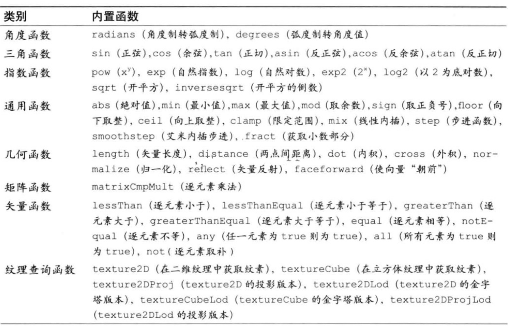
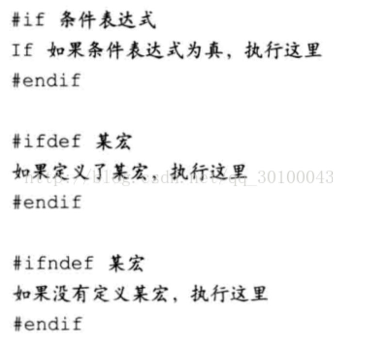

## GLSL ES
### 执行顺序
着色器语言与 `C` 语言更接近, 着色器语言从 `main()` 函数开始执行。

同时着色器程序必须`有且仅有`一个 `main()` 函数。

### 注释
着色器程序中的注释与 `JavaScript` 一致。

### 强类型语言
`GLSL ES` 为强类型语言, 必须通过如下形式声明变量:
```
<类型> <变量名>
```

### 基本类型
类型 | 描述
-- | --
float | 单精度浮点数类型。该类型的变量表示一个单精度浮点数。
int | 整数型。该类型的变量表示一个整数。
bool | 布尔型。该类型的变量表示一个布尔值(`true` 或 `false`)。

为变量指定类型有利于 `WebGL` 系统检查代码错误, 提高程序的运行效率。

**注**: 如果习惯于使用 `Typescript` 的程序员, 将很好理解这一点。

### 赋值
因为为强类型语言, 赋值时右侧赋值必须与左侧的声明类型一致, 否则报错。
```glsl
int i = 1; // √
int i = 1.0; // x
```

### 类型转换
在着色器程序中, 类型转化需要显示调用, 与 `JavaScript` 不同:
转换 | 函数 | 描述
-- | -- | --
转换为整数型 | int(float/bool) | 将浮点数的小数部分删去, 转为整数型。而布尔型中 `ture` 转化为 `1`, `false` 转化为 `0`。
转换为浮点数 | float(int) | 将整数型转化为浮点数(如: `8` 转化为 `8.0`)。
转换为布尔型 | bool(int/float) | `0` 或 `0.0` 转为 `flase`, 其他均为 `true`。

### 运算符
类别 | GLSL ES 数据类型 | 描述
--|--|--
+| 加法 | -
-| 减法 | -
*| 乘法 | `int` 或 `float`, 运算的返回值类型与参与运算的值类型相同。
/| 除法 | -
-| 取负(比如, 指定一个负数) | `int` 或 `float`。
++| 自增(前缀或后缀) | `int` 或 `float`, 运算的返回值类型与参与运算的类型相同。
--| 自减(前缀或后缀) | `int` 或 `float`, 运算的返回值类型与参与运算的类型相同。
=| 赋值 | `int`、`float` 或 `bool`
+= -= *= /= | 算术赋值 | `int` 或 `float`
< > <= >= | 比较 | -
== != | 比较(是否相等) | `int`、`float` 或 `bool`
! | 取反 | `bool` 或结果为 `bool` 类型的表达式
&& | 逻辑与 | -
&brvbar;&brvbar; | 逻辑或 | -
^^ | 逻辑异或 | -
condition ? expression1:expression2 | 三元表达式 | -

### 矢量和矩阵
`GLSL ES` 支持矢量和矩阵类型, 这两种类型很适合处理计算机图形。  
矢量和矩阵类型的变量都包含多个元素, 每个元素是一个数值(`int`、`floar` 或 `init`)。

#### 类型
类别 | GLSL ES 数据类型 | 描述
--|--|--
矢量 | vec2、vec3、vec4 | 具有2、3、4个浮点数元素的矢量。
矢量 | ivec2、ivec3、ivec4 | 具有2、3、4个整型数元素的矢量。
矢量 | bvec2、bvec3、bvec4 | 具有2、3、4个布尔值元素的矢量。
矩阵 | mat2、mat3、mat4 | 2x2, 3x3, 4x4 的浮点数元素的矩阵(分别具有 4, 9, 16 个元素)。

#### 赋值和构造
赋值形式如下:
```glsl
vec4 position = vec4(1.0, 1.0, 1.0, 1.0);
```

其中赋值左侧 `vec4` 声明了 `position` 的类型, 右侧使用 `vec4()` 构造函数形式进行赋值。

矢量构造函数:
- `vec2`
- `vec3`
- `vec4`

矢量构造函数在使用过程中, 可以忽略一部分参数, 不足的部分会使用 `0.0` 进行补足:
```glsl
vec4 position = vec4(1.0); // ==> 等价 vec4(1.0, 0.0, 0.0, 0.0)
```

矩阵构造函数:
- `mat2`
- `mat3`
- `mat4`

矩阵构造函数在使用过程中, 可以忽略一部分参数, 不足的部分会进行补足:
```glsl
// 1. 忽略一部分参数
mat3 m3 = mat3(1.0); 
// ==> 对角线上均为传入的数值, 其余部分用 0.0 补足
// 1.0, 0.0, 0.0,
// 0.0, 1.0, 0.0,
// 0.0, 0.0, 1.0,

// 2. 使用矢量构建
vec2 v2_1 = vec2(1.0, 0.0);
vec2 v2_2 = vec2(0.0, 1.0);

mat2 m2 = mat2(v2_1, v2_2);
// 1.0, 0.0,
// 0.0, 1.0,

// 3. 或者这样
vec4 v4 = vec4(1.0, 0.0, 0.0, 1.0);
mat2 m2 = mat2(v4);
// 1.0, 0.0,
// 0.0, 1.0,

// 4. 矢量与数值混用
vec2 v2 = vec2(0.0, 1.0);

mat2 m2 = mat2(1.0, 0.0, v2);
// 1.0, 0.0,
// 0.0, 1.0,

// 5. 数值大于1且未满足构造函数, 报错
mat2 m2 = mat2(1.0, 2.0); // ==> 错误 x
```

#### 访问元素
可以通过 `.` 或 `[]` 这种形式访问元素, 访问形式类似于 `JavaScript` 中的对象。

分量名:
类别 | 描述
--|--
x,y,z,w | 用来获取顶点坐标分量
r,g,b,a | 用来获取颜色分量
s,t,p,q | 用来获取纹理坐标分量

`.` 运算符:
```glsl
vec3 v3 = vec3(1.0, 2.0, 3.0); // 分别为 x,y,z 因为没有第四个分量, 所以 w 无法访问

v3.x; // ==> 1.0

// 其中与 js 不同, 可以同时抽出多个, 这一过程叫做混合
vec v2 = v3.xy; // ==> (1.0, 2.0);
```

`[]` 运算符:
```glsl
mat2 m2 = mat2(1.0, 0.0, 0.0, 1.0);

m2[0]; // ==> [1.0, 0.0];
m2[0][1]; // ==> 0.0
m2[0].y; // ==> 0.0
```

`[]` 运算符内`只能`出现常量索引值:
- 整型字面量(0,1等)
- 用 `const` 修饰的全局变量或局部变量, 不包括函数参数
- 循环索引
- 由前述三条中的项组成的表达式

```glsl
const int i1 = 1;
m2[i1]; // ==> [0.0, 1.0]
int i2 = 0;
m2[i2]; // x 未经过 const 修饰
```

#### 运算符
矢量和矩阵支持的运算符:

运算符 | 运算 | 适用数据类型
--|--|--
*| 乘法 | 适用于 `vec[234]` 和 `mat[234]`。
/| 除法 | -
+| 加法 | 运算结果的数据类型与参加运算的类型一致。
-| 减法 | -
++| 自增(前缀或后缀) | 适用于 `vec[234]` 或 `mat[234]`, 运算结果的数据类型与参与运算的类型一致。
--| 自减(前缀或后缀) | -
=| 赋值 | 适用于 `vec[234]` 或 `mat[234]`
+=, -=, *=, /=| 运算赋值 | 适用于 `vec[23¢]` 或 `mat[234]`。
==, !=| 比较 | 适用于 `vec[234]` 或 `mat[23¢]`。对于 `==`, 如果两个操作数的每一个分量都相同, 那么返回 `true`; 对于 `!=`, 如果两个操作数的任何一个分量不想等, 返回 `true`。

### 结构体
`GLSL ES` 支持用户自定义的类型, 即`结构体`。使用关键字 `struct`, 将已存在的类型聚合到一起, 就可以定义为结构体。
```glsl
// 定义名为 light 的结构体
struct light {
    vec4 color;
    vec3 position;
}

light l1,l2; // 声明了 light 类型的变量 l1,l2
```

#### 赋值和构造
结构体有标准的构造函数, 其名称与结构体一致。  
同时构造函数的参数顺序必须与结构体定义中的成员顺序一致。
```glsl
l1 = light(vec4(1.0, 0.0, 0.0, 1.0), vec3(1.0, 0.0, 0.0));
```

#### 访问成员
在结构体变量名后跟 `.` 运算符, 然后再加上成员名, 就可以访问变量的成员。
```glsl
vec4 color = l1.color;
vec3 position = l1.position;
```

#### 运算符
结构体的成员可以参与其自身类型支持的任何运算, 但结构体本身只支持两种运算:

运算符|运算| 描述
--|--|--
=| 赋值 | 赋值和比较运算符不适用于含有数组与纹理成员的结构体。
==, != | 比较 | -

### 数组
`GLSL ES` 支持数组类型。与 `JavaScript` 中数组不同, `GLSL ES` 只支持一维数组, 而且数组对象不支持 `pop()` 与 `push()` 等操作, 创建时不需要使用 `new`, 同时无法一次性初始化, 必须显示的对每个元素进行初始化。
```glsl
float floatArray[4]; // 声明包含 4 个浮点数元素的数组
vec4 vec4Array[2]; // 声明含有 2 个 vec4 对象的数组
vec4Array[0] = vec4(1.0, 0.0, 0.0, 1.0);
vec4Array[1] = vec4(1.0, 1.0, 1.0, 1.0);
```

其中, 数组的长度必须是大于0的`整型常量表达式`:
- 整型字面量(0,1等)
- 用 `const` 修饰的全局变量或局部变量, 不包括函数参数
- 由前述两条中的项组成的表达式

### 取样器(纹理)
将 `GLSL ES` 中支持的一种内置类型称为`取样器(sampler)`, 通过使用该类型来访问纹理。  
有两种基本的取样器类型: `sampler2D` 和 `samplerCube`。  
取样器变量只能是 `uniform` 变量, 或者需要访问纹理的函数, 如 `texture2D()` 函数的参数。
```glsl
uniform sampler2D u_Sampler;
```

取样器除了 `=`, `==` 和 `!=`, 不可作为操作数参与运算。  
同时, 取样器变量受到着色器支持的纹理单元的最大数量限制, 其中 `mediump` 是一个精度限定字:

着色器 | 表示最大数量的内置常量 | 最小数量
--|--|--
顶点 | const mediump int gl_MaxVertexTextureImageUnits | 0
片元 | const mediump int gl_MaxTextureImageUnits | 8

### 运算符优先级
优先级 | 运算符
--|--
1 | 圆括号(`()`)
2 | 函数调用(`()`), 数组索引(`[]`), 点操作符(`.`)
3 | 自增和自减(`++`、`--`), 负(`-`), 取反(`!`)
4 | 乘(`*`),除(`/`),余(`%`)
5 | 加(`+`),减(`-`)
6 | 按位移(`<<`, `>>`)
7 | 大小比较(`<`, `<=`, `>`, `>=`)
8 | 判断相等(`==`, `!=`)
9 | 按位与(`&`)
10 | 按位异或(`^`)
11 | 按位或(`｜`)
12 | 与(`&&`)
13 | 异或(`^^`)
14 | 或(`｜｜`)
15 | 三元表达式(`?:`)
16 | 运算赋值(`+=`、`-=`、`*=`、`/=`、`%=`、`<<=`、`>>=`、`&=`、`^=`、`｜=`)
17 | 顺序运算符, 即逗号(`,`)

### 流程控制: 分支与循环
与 `JavaScript` 中几乎一致。
#### if语句和if-else语句
```glsl
if(条件表达式) {
    // something...
} else {
    // something...
}
```

着色器`没有` `switch` 语句, 同时过多的 `if-else` 将影响程序执行性能。

#### for语句
```glsl
for(初始化表达式, 条件表达式, 循环步进表达式) {
    // something...
}
```

**注意**: 循环变量只能在`初始化表达式`中定义。 `条件表达式`可以为空, 如果这样做空表达式返回 `true`。此外, `for` 语句还有如下一些限制:
- 只允许有一个循环变量
- 循环表达式必须是以下的形式:
  - i++
  - i--
  - i+=常量表达式
  - i-=常量表达式
- `条件表达式`必须是循环变量与整型常量的比较
- 在循环体中, 循环变量不可被赋值

#### continue、break 和 discard 语句
`continue` 和 `break` 与 `JavaScript` 中效果一致, 通常都是与 `if` 一起使用, 跳过某一步或某些步骤时使用。  
`discard` 只能在片元着色器中使用, 表示放弃当前片元直接处理下一个片元。

### 函数
定义形式与 `C` 语言类似:
```glsl
返回类型 函数名(type0 arg0, type1 arg1, ..., typen argn) {
    函数计算
    return 返回值;
}
```

其中参数的 `type` 必须是上述类型中的一种, 或者类似于 `main()` 函数一样没有参数也是允许的。  
如果函数没有返回值, 那么函数中就不需要 `return` 语句。但这种情况下, 返回类型必须是 `void`。  
也可以将自定的结构体类型指定为返回类型, 但是结构体的成员不能有数组。

**注意**: `GLSL ES` 中递归是不允许的。

#### 规范声明
如果函数定义在其调用之后, 必须在之前先声明(`没有`变量提升这么一说)该函数的规范。  
规范声明会预先告诉 `WebGL` 系统函数的参数、参数类型、返回值等。
```glsl
float luma(vec4); // 规范声明
void main() {
    // something...
    float brightness = luma(color); // 声明之前调用
    // something...
}

float luma(vec4 color) {
    float col;
    // something...
    return col;
}
```

#### 参数限定词
`GLSL ES` 中, 可以为函数参数指定限定字, 以控制参数的行为。可以将函数参数定义为:
1. 传递给函数的
2. 将要在函数中被赋值的
3. 既是传递给函数的, 也是将要在函数中被赋值的

类别 | 规则 | 描述
--|--|--
in | 向函数中传入值 | 参数传入函数, 函数内可以使用参数的值, 也可以修改其值。但函数内部但修改不会影响传入的变量。
const in | 向函数中传入值 | 参数传入函数, 函数内可以使用参数的值, 但不能修改
out | 在函数中被赋值, 并被传出 | 传入变量的引用, 若其在函数内被修改, 会影响到函数外部传入的变量
inout | 传入函数, 同时在函数中被赋值, 并被传出 | 传入变量的饮用, 函数会用到变量的初始值, 然后修改变量的值。会影响到函数外部传入的变量。
<无: 默认> | 将一个值传给函数 | 和 `in` 一样

定义一个 `out` 参数:
```glsl
void luma(vec3 color, out float brightness) {
    brightness = color.x + color.y + color.z;
}
```

实际上 `luma` 函数并没有返回值, 但是执行之后, 外部可以调用 `brightness` 参数。

### 内置函数
`GLSL ES` 提供了许多内置的函数:



### 全局变量和局部变量
`GLSL ES` 中, 如果变量声明在函数的外面, 那么就是`全局变量`, 如果声明在函数内部, 那就是`局部变量`。

### 存储限定字
#### const
`const` 限定字表示该变量的值是不可改变的。  
声明时必须进行初始化。

```glsl
const int i = 1;
```

#### attribute
`attribute` 变量`只能`出现在`顶点着色器`中, 只能被声明为`全局变量`, 被用来表示`逐顶点`的信息。  
`attribute` 变量只能是 `float`, `vec2`, `vec3`, `vec4`, `mat2`, `mat3` 和 `mat4`。

```glsl
attribute vec4 a_Color;
attribute float a_PointSize;
```

#### uniform
`uniform` 变量可以用在顶点着色器和片元着色器中, 且必须是全局变量。  
`uniform` 变量是只读的, 它可以是**除**了`数组`或`结构体`之外的**任意类型**。  
如果顶点着色器和片元着色器声明了同名的 `uniform` 变量, 那么它就会被两种着色器共享。  
`uniform` 变量包含了 `一致` 的数据(也就是说, 即不是顶点着色器特有的, 也不是片元着色器特有的, 而是两者公用的数据), 如变换矩阵。

```glsl
uniform mat4 u_ViewMatrix;
```

#### varying
`varying` **必须**是全局变量, 其目的是从顶点着色器向片元着色器传递数据。  
必须在两种着色器中声明同名, 同类型的 `varying` 变量。  
`varying` 变量只能是 `float`, `vec2`, `vec3`, `vec4`, `mat2`, `mat3` 和 `mat4`。

```glsl
varying vec2 v_Color;
```

数目限制:
变量类型 | 内置全局变量(表示最大数量) | 最小值
attribute | const mediump int gl_MaxVertexAttribs | 8
uniform(顶点着色器) | const mediump int gl_MaxVertexUniformVectors | 128
uniform(片元着色器) ｜ const mediump int gl_MaxFragmentUniformVectors | 16
varying | const mediump int gl_MaxVaryingVectors | 8

### 精度限定字
`GLSL ES` 新引入来精度限定字, 目的是帮助着色器程序提高运行效率, 削减内存开支。  
精度限定字用来表示每种数据具有的精度(比特数)。  
可选的适中精度如下:
```glsl
#ifdef GL_ES
precision mediump float;
#endif
```

**注意**: 低精度的情况下, `WebGL` 程序的运行结果会比较粗糙或不准确, 必须在程序效果和性能间进行平衡。

精度限定字:

精度限定字|描述|默认数值范围和精度
--|--|--
highp | 高精度, 顶点着色器的低高精度 | Float (-2<sup>62</sup>, 2<sup>62</sup>) 精度 2<sup>-16</sup>, int (-2<sup>16</sup>, 2<sup>16</sup>)
mediump | 中精度, 介于高精度与低精度之间, 片元着色器的最低精度 | Float (-2<sup>14</sup>, 2<sup>14</sup>) 精度 2<sup>-10</sup>, int (-2<sup>10</sup>, 2<sup>10</sup>)
lowp | 低精度, 低于中精度, 可以表示所有颜色 | Float (-2, 2) 精度 2<sup>-8</sup>, int (-2<sup>8</sup>, 2<sup>8</sup>)

为每个变量声明精度过于繁琐, 可以使用关键字 `precision`:
```glsl
precision 精度限定字 类型名称;
```

默认精度:  
着色器类型 | 数据类型 | 默认精度
--|--|--
顶点 ｜ int | highp
顶点 | float | highp
顶点 | sampler2D | lowp
顶点 | samplerCube | lowp
片元 | int | mediump
片元 | float | 无
片元 | sampler2D | lowp
片元 | samplerCube | lowp

由于片元着色器中的 `float` 没有默认精度, 所以在使用片元着色器时需要手动设置精度, 否则报错。

### 预处理指令
`图片出处见水印`
