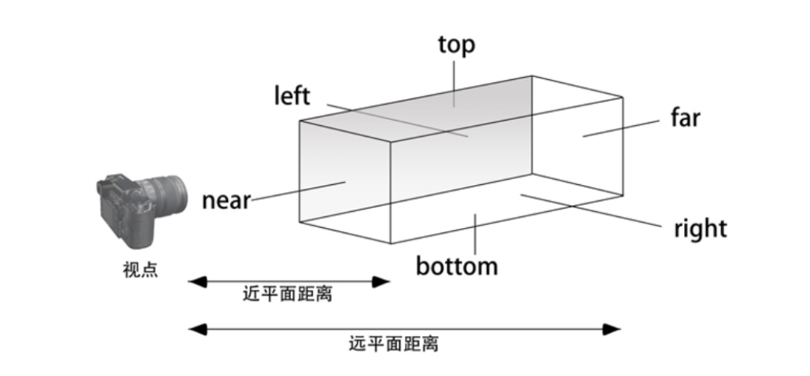

## webgl-3d-vision-1
虽然可以将三维物体放在三维空间中的任何地方, 但只有当它在 `可视范围` 内时, `WebGL` 才会进行绘制。

除了 `水平` 和 `垂直` 范围内的限制, `WebGL` 还限制观察者的可视深度, 即"能够看多远"。

所有的这些限制, 包括 `水平视角`, `垂直视角` 和 `可视深度`, 定义了**可视空间**(view volume)。

### 1. 可视空间
有两类可视空间:
- `正射投影`: 长方体可视空间, 也称盒装空间。
- `透视投影`: 四棱锥/金字塔可视空间。

#### 1.1 正射投影

可视空间由前后两个矩形表面确定, 分别称为 `近裁剪面`(near clipping plane) 和 `远裁剪面`(far clipping plane)。  
近裁剪面与远裁剪面之间的盒型空间就是可视空间, 只有在此空间内的物体会被显示出来。  
如果某个物体的一部分在可视空间, 一部分在其外, 那就只显示空间内的部分。  
`<canvas>` 上显示的就是可视空间中物体在 `近裁剪面` 上的投影。