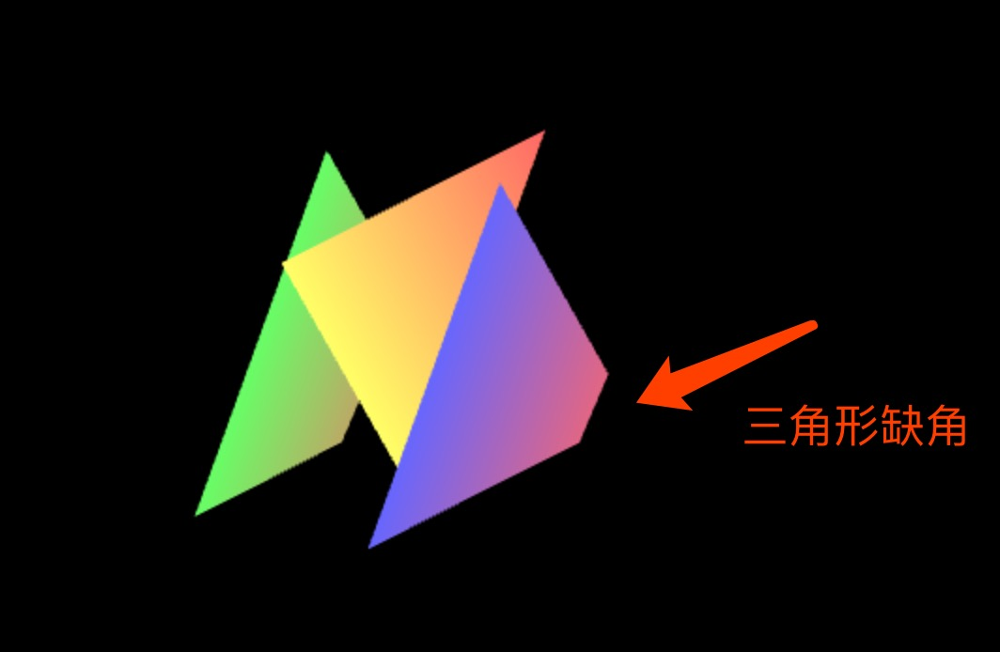
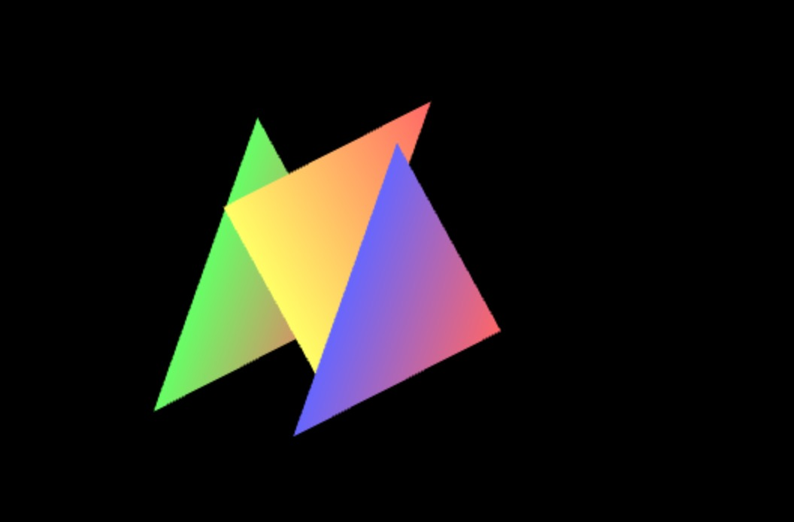

## webgl-3d-vision-2
图片截图自 `27` 节:

27.webgl-3d-with-key 中, 在旋转过程中, 某些情况下会导致三角形缺角的现象, 现在使用正投影矩阵进行修复。

修复后:

### 渲染出的图像会随着近裁剪面的宽高比进行改变
- `同比缩放`: 如果比例不变, 可视范围的宽高同时扩大 `2` 倍, 显示的图像为原本的 `1/2` 大小。
- `不等比`: 比例发生变动, 显示的图像也会随比例进行变化。

**注**: 某些超出边界的部分同样会被裁剪。